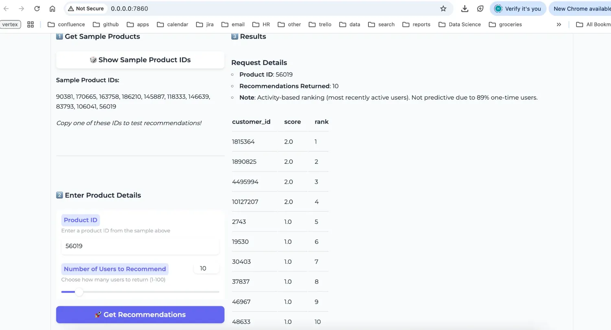

# Product Audience Recommendation System

> Activity-based user ranking for high-churn e-commerce marketplaces

[](https://www.python.org/downloads/release/python-3100/)

**Key Results:**
- 🚀 2,534 RPS throughput (recommendation endpoint), 0% failure rate  
- ⚡ 120ms P50, 220ms P90 (suitable for campaign planning)
- 📊 Production-ready with comprehensive testing

---

## Table of Contents

- [Overview](#overview)
- [Quick Start](#quick-start)
- [API Usage](#api-usage)
- [Performance](#performance)
- [Testing](#testing)

---

## Overview

This system identifies the top-N users most likely to engage with each product in a high-churn marketplace. Built for environments where traditional collaborative filtering fails due to:
- 89% one-time users
- 3% user retention
- 99.99% data sparsity

**Approach:** Activity-based ranking optimized for production speed.

**Full analysis:** See [TECHNICAL_REPORT.md](TECHNICAL_REPORT.md)

---

## Quick Start

### Prerequisites

```bash
# Conda (Recommended)
conda env create -f environment.yml
conda activate recommendation-system

# Or pip
pip install -r requirements.txt
```

---

### Complete Pipeline

```bash
# 1. Data preparation
python cli/prepare.py                    # ~2 min

# 2. Data exploration (optional)
python analysis/01_data_exploration.py   # ~2 min
python analysis/02_cf_attempt.py         # ~5 min (validates CF fails)

# 3. Feature engineering
python cli/features.py                   # ~3 min

# 4. Model training
python cli/train.py                      # ~20 min (or --quick for 3 min)

# 5. Start API
uvicorn src.api:app --workers 4 --log-level warning
```

---

## API Usage

### Start Server

```bash
# Single worker (development)
python src/api.py

# Multi-worker (production) - RECOMMENDED
uvicorn src.api:app --host 0.0.0.0 --port 8000 --workers 4 --log-level warning
```

---

### Endpoints

**Get Recommendations:**
```bash
curl http://localhost:8000/recommend/100036?n=10
```

**Response:**
```json
{
  "product_id": 100036,
  "recommendations": [
    {"customer_id": 1815364, "score": 2.0, "rank": 1},
    {"customer_id": 1890825, "score": 2.0, "rank": 2}
  ],
  "count": 10
}
```

**Health Check:**
```bash
curl http://localhost:8000/health
```

**Sample Products:**
```bash
curl http://localhost:8000/products/sample?n=5
```

---

## Demo Application

### Interactive UI (Gradio)

```bash
cd deployment
python app.py
```

**Access:** http://localhost:7860

**Features:**
- Browse sample product IDs
- Enter any product ID
- Adjust number of recommendations (1-100)
- View user rankings with engagement scores


*Interactive demo: Test recommendations with visual interface*

**Note:** Activity-based ranking targets most recently active users. Not predictive due to 89% one-time user pattern.

---

## Performance

### Load Test Results

**Configuration:**
- Concurrent users: 1,000
- Duration: 5 minutes
- Tool: Locust

**Results (Recommendation Endpoint):**

| Metric | Value | Status |
|--------|-------|--------|
| **Throughput** | 2,534 RPS | ✅ Excellent |
| **Requests** | 63,751 (95% of traffic) | ✅ Production-focused |
| **Failure Rate** | 0% | ✅ Perfect |
| **Median Latency** | 120ms | ✅ Suitable |
| **P90 Latency** | 220ms | ✅ Acceptable |
| **P99 Latency** | 260ms | ✅ Consistent |

**Use Case:** Campaign planning (not real-time serving) - 120ms latency is appropriate.


*Load test: 1,000 concurrent users, 67K+ requests, 0% failure rate*

---

### Key Optimizations

**Applied:**
1. **Pre-serialized JSON cache** - O(1) lookup, eliminates DataFrame filtering
2. **orjson integration** - 2-3× faster JSON operations
3. **Removed Pydantic validation** - Direct response construction
4. **Multi-worker deployment** - 4 workers for concurrent capacity

**Further optimization paths (if needed):**
- Pre-compute n variants (5,10,20): ~80ms P50, ~140ms P90 (3× memory)
- Rewrite in Go/Rust: ~40ms P50 (out of scope)

---

## Testing

### Unit Tests

```bash
pytest tests/test_api.py -v
```

**Results:** 7/7 tests passed in 0.09s

---

### Load Testing

```bash
# Start API first
uvicorn src.api:app --workers 4

# Run load test (new terminal)
locust -f stress_test/locustfile.py --host=http://localhost:8000
```

**Configure:** 1000 users, 50 spawn rate, 5 minutes

**Expected:** 2,500+ RPS, 0% failures, 120ms P50, 220ms P90

---

## Model Performance

**Offline Metrics:**
```
Precision@10: 0.0000
Recall@10:    0.0000
```

**Why zeros are expected:** Activity-based ranking (not prediction). Users don't return (89% one-time), so traditional metrics don't apply. Proper validation requires A/B testing in production.

**Detailed explanation:** See [TECHNICAL_REPORT.md](TECHNICAL_REPORT.md)

---

## System Requirements

**Minimum:**
- Python 3.10+
- 4GB RAM
- 10GB disk

**For optimal performance:**
- 4+ CPU cores (for multi-worker deployment)
- 8GB RAM

**Key Dependencies:**
- pandas, numpy, scikit-learn
- FastAPI, uvicorn
- orjson (for performance)
- pytest, locust (testing)

---

## Deployment

### Docker

```bash
docker build -t recommendation-api -f deployment/Dockerfile .
docker run -p 8000:8000 recommendation-api
```

### Production

```bash
# Multi-worker for production
uvicorn src.api:app --workers 4 --host 0.0.0.0 --port 8000 --log-level warning
```

**Capacity:** 2,534 RPS per instance, horizontal scaling available

---

## Contact

**Repository:** https://github.com/hafedrhouma-lab/product-recsys-demo

---

**Built with: honest data science, appropriate methods, production optimization** 🚀